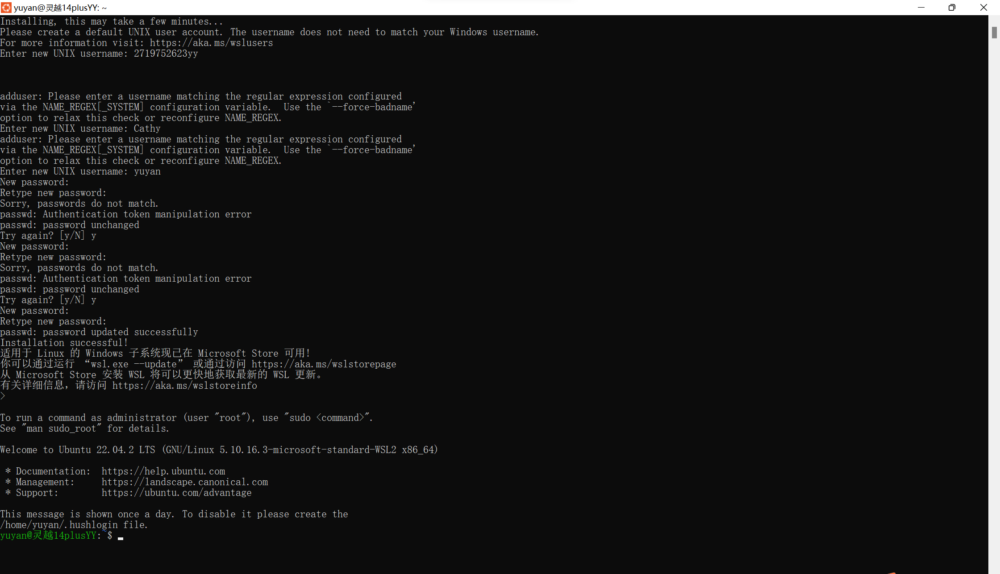
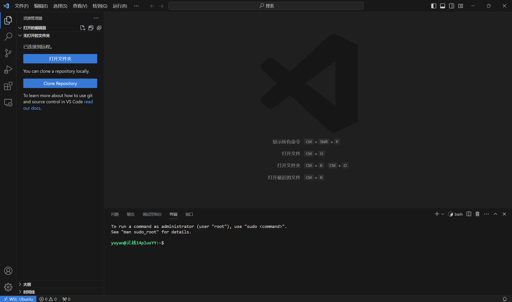

# #3 Linux & WSL&Docker

## 1.安装配置 WSL2 的 Ubuntu

我在暑假的时候瞎装了Ubuntu，但是没有安装WSL2。经过审查，经过以下步骤操作：

### 步骤

1. 以管理员身份打开 Windows PowerShell 。

2. 运行以下命令以启用适用于 Linux 的 Windows 子系统和虚拟机平台功能：

   ```
   dism.exe /online /enable-feature /featurename:Microsoft-Windows-Subsystem-Linux /all /norestart
   ```

3. 继续运行以下命令    

   ```
   dism.exe /online /enable-feature /featurename:VirtualMachinePlatform /all /norestart
   ```

   并启用计算机中的虚拟机

4. 启动 Ubuntu 应用。

5. 在首次运行时，根据要求设置用户名和密码。

6.通过 `VScode` 的 `Remote` 插件连接至虚拟机 / WSL2 

7.Windows下使用Xshell的主要目的是通过SSH协议连接和管理远程服务器或网络设备。以下是一些常见的使用场景和目的：

* 远程服务器管理：Xshell可以提供一个安全的终端连接，让用户能够直接在本地计算机上操作和管理远程服务器，可以通过输入命令执行系统管理任务、安装软件、配置网络等。

* 文件传输：Xshell内置了文件传输功能，可以方便地在本地计算机和远程服务器之间进行文件的上传和下载。这对于备份文件、传输数据或部署应用程序非常有用。

* 远程访问和控制：通过Xshell连接到远程服务器，用户可以像在本地一样访问和操作远程计算机，包括使用图形界面、编辑文件、运行远程应用程序等。

* 开发和调试：Xshell可以作为开发人员的工具，通过SSH连接到远程开发环境，进行编程、调试和测试。特别对于远程Linux服务器上的开发任务，Xshell提供了便捷的命令行界面和编辑功能。

* 网络设备管理：Xshell也可用于管理网络设备，如交换机、路由器、防火墙等。通过SSH连接到这些设备，用户可以进行配置、监控和故障排除等操作。

8.经过资料查找以后的感想

Linux作为一个强大而灵活的操作系统，在软件开发领域具有广泛的应用。许多开发人员喜欢使用Linux作为他们的主要开发环境，其中一些原因包括：

1. 开放源代码：Linux是开放源代码的操作系统，这意味着用户可以自由地查看、修改和定制系统的各个组件。这使得开发人员更容易理解系统内部工作原理，并根据自己的需求进行定制，提供更好的开发体验。
2. 强大的终端和命令行工具：Linux提供了强大的终端和命令行工具，使得开发人员能够高效地执行各种任务，如编译代码、执行脚本、管理版本控制等。命令行工具的灵活性和可扩展性可以大大提高开发效率。
3. 丰富的软件生态系统：Linux拥有丰富的软件包管理器，可以方便地获取和安装各种开发工具和库。此外，许多开源项目更倾向于在Linux上进行开发和测试，因此在Linux环境下使用这些工具可能更加方便和兼容。
4. 高度可定制性：Linux的开放性和灵活性使得开发人员可以根据自己的需求对系统进行高度定制。他们可以选择自己喜欢的桌面环境、编辑器、终端工具等，并进行个性化配置，提供更好的开发体验。

然而，每个开发人员和团队在选择开发环境时应考虑自己的需求和偏好。Windows作为另一种常用的操作系统，在某些方面也具有优势，如广泛的商业软件支持、易用性等。

最重要的是，开发环境的选择应该基于项目需求、团队协作和个人舒适度等因素进行权衡。无论是选择使用Linux还是Windows，都可以通过适当的配置和工具来满足您的开发需求。
