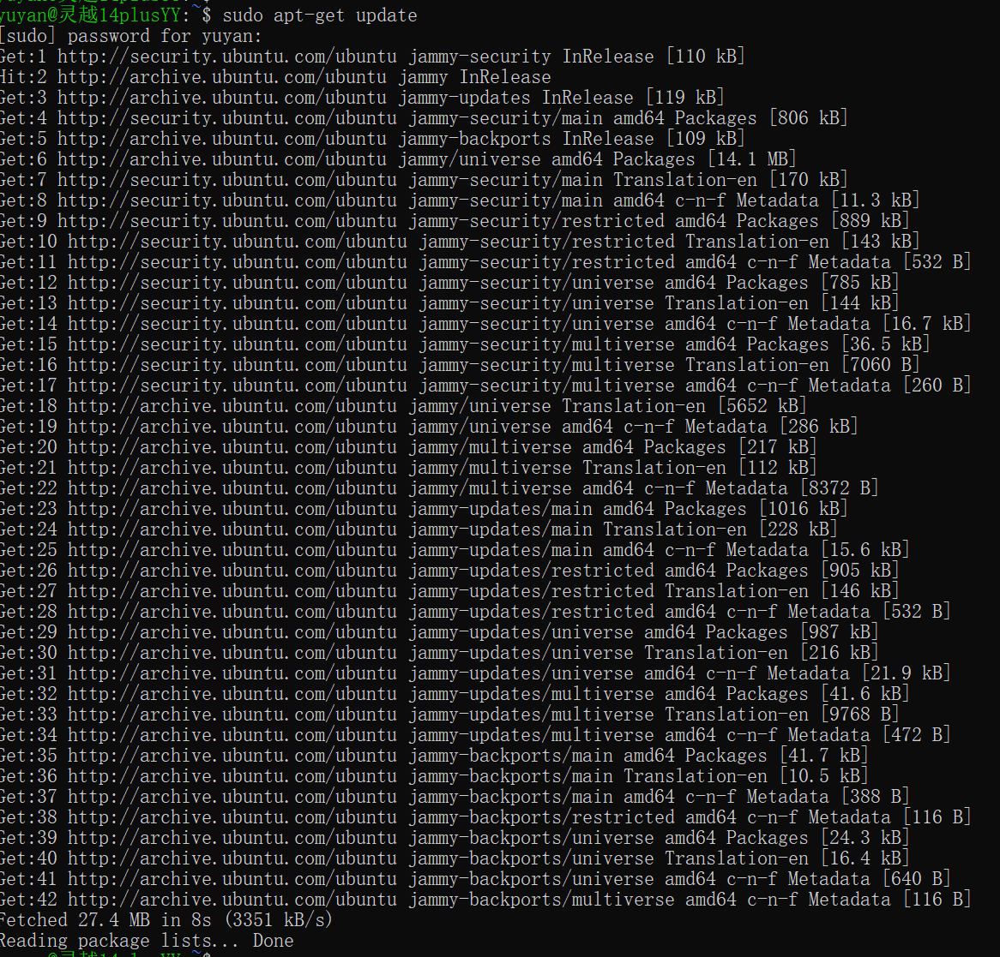
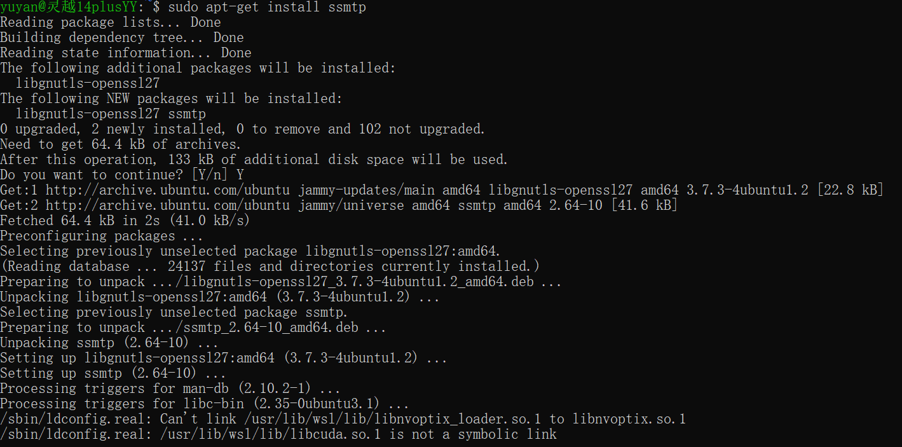
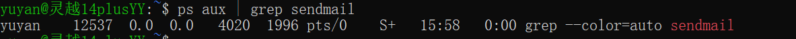
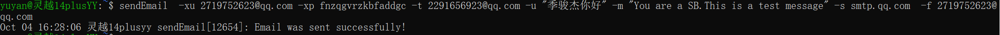
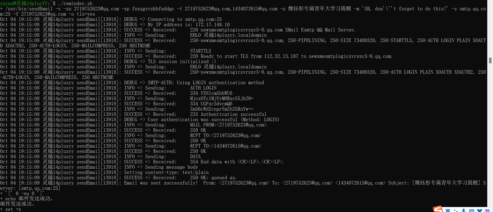
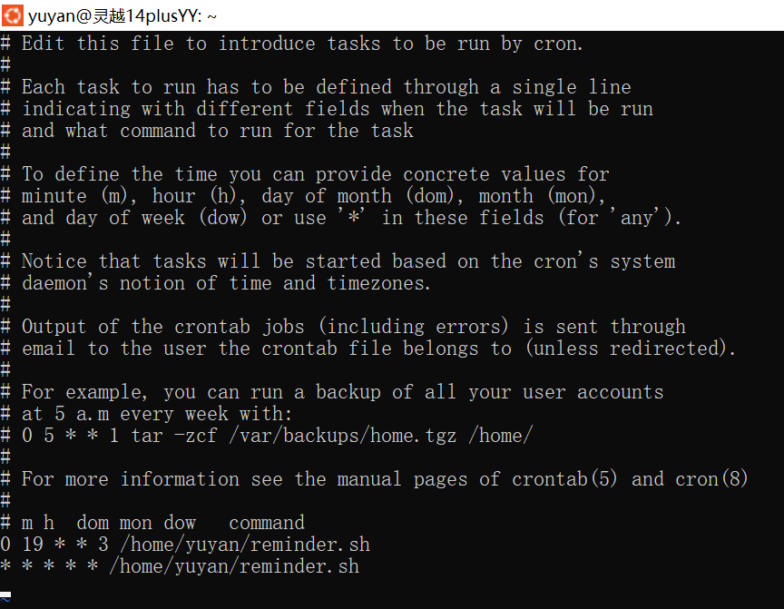

# #4 shell & Makefile

次要方向，主要是对写脚本感兴趣，想尝试一下。

## shell的工作原理

1. 提示符：当您启动一个终端窗口或打开一个终端会话时，Shell会显示一个提示符，指示您可以输入命令。
2. 读取命令：当您键入命令并按下回车键时，Shell会读取您输入的命令。
3. 解析命令：Shell会解析您输入的命令，将其分解成可识别的组件，例如命令本身、选项、参数等。
4. 查找命令：Shell会根据解析后的命令，查找可执行的程序或命令。它首先检查内置命令，如果找到则直接执行；如果没有找到，则会搜索系统的可执行文件路径，例如`/bin`、`/usr/bin`等目录。
5. 执行命令：一旦找到可执行的命令，Shell会调用操作系统提供的机制来运行该命令。这可能涉及创建一个新的进程，并将命令及其参数传递给该进程。
6. 命令输出：一旦命令完成执行，Shell会显示命令的输出结果（如果有的话）。
7. 等待下一个命令：在命令执行完毕后，Shell会等待下一个命令的输入。这个过程循环进行，直到用户主动退出。

除了上述基本步骤，Shell还提供了丰富的功能，如处理变量、重定向输出、管道、脚本编写等等，以方便用户进行更复杂的操作。

## 尝试：使用shell写一个定时脚本

功能：如果早上九点钟我如果没有打开过我的电脑，自动发邮件给妈妈我今天生病了，请帮我请病假。

### 1.安装邮件发送服务





### 2.打开qq邮箱，开启smtp服务，并获取授权码

### 3. 配置 ssmtp

安装完成后，需要进行 ssmtp 的配置。

在终端中输入：

```
sudo vim /etc/ssmtp/ssmtp.conf
```

打开之后，你需要修改其中的以下字段：

```
bashCopy Coderoot=<你的邮箱>
mailhub=smtp.<你的邮箱提供商>.com:25
rewriteDomain=<你的邮箱提供商>.com
AuthUser=<你的邮箱用户名>
AuthPass=<你的邮箱密码>
FromLineOverride=YES
UseTLS=YES
```

其中，<你的邮箱> 是你的邮箱地址，<你的邮箱提供商> 是你的邮箱提供商（例如 `gmail.com` 或 `163.com`）。

### ***然而，在测试邮件的时候，总是报错 ``ssmtp: 501 Mail from address must be same as authorization user.``反复修改无果，决定改用 ``sendmail``***

### 4.安装
1. ``sendmail``必须先要安装两个包
    ``sudo apt-get install sendmail``
    ``sudo apt-get install sendmail-cf   # 配置工具``
2. ubuntu下最常使用的是mail功能，需要安装``mailutils``
    ``sudo apt-get install mailutils``
3. 若需要使用带“附件”的功能，还需要安装``sharutils``
    ``sudo apt-get install sharutils``
4. 测试
    输入命令：``ps aux | grep sendmail``
    
5. 使用``sendEmail``命令发送邮件

注意：不要使用``sendemail``命令，这个是局域网内部发送使用的。

``sendEmail -xu 2719752623@qq.com -xp Password -t 2291656923@qq.com -u "季骏杰你好" -m "You are a SB.This is a test message" -s smtp.qq.com -f 2719752623@qq.com``

-t 是接受邮箱地址

-f 是发送邮箱地址

-xu 是smtp邮箱用户名

-xp 是smtp的授权码

-u 是主题

-m 是邮件正文

-s 是smtp服务器域名



6.编写脚本

经过无数次报错和修改后（包括修改脚本格式，还有465端口总是连接不上，查了无数资料以后尝试25端口，最后获得稳定连接）

``` \#!/bin/bash
#!/bin/bash
set -x  # 启用调试模式

/usr/bin/sendEmail -v \
          -xu 2719752623@qq.com \
          -xp Passwd \
          -t 2719752623@qq.com,1434072615@qq.com \
          -u "魏钰彤专属青年大学习提醒" \
          -m "SB, don't forget to do this!" \
          -s smtp.qq.com:25 \
          -f 2719752623@qq.com \
          -o tls=yes

if [ $? -eq 0 ]; then
    echo "邮件发送成功。"
else
    echo "发送邮件时出错，请稍后再试。"
fi

set +x  # 关闭调试模式
```

测试脚本



7.用crontab设置定时



8.进行每分钟一次的测试，测试成功


