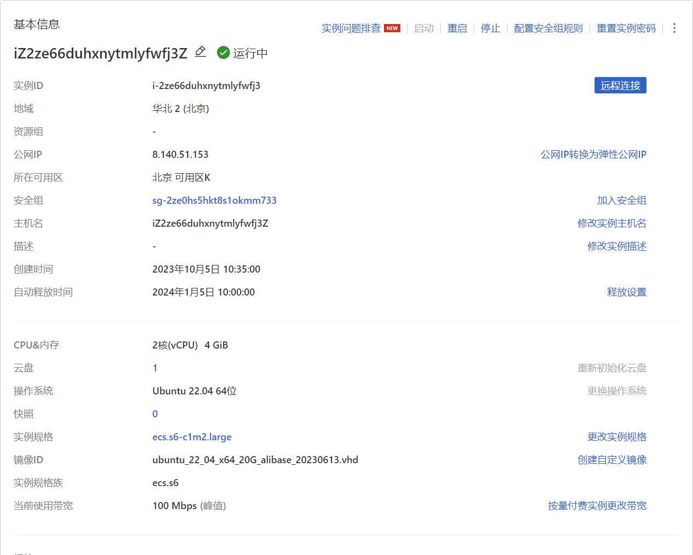
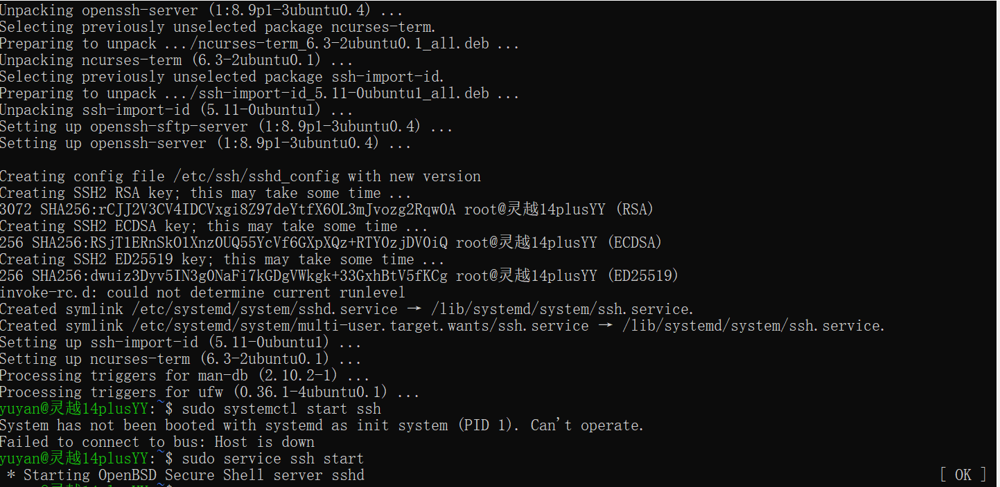
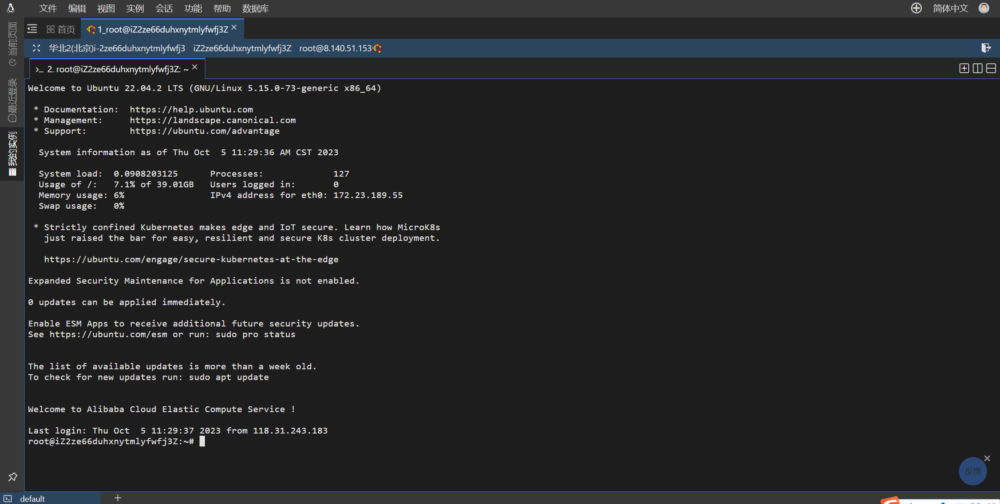
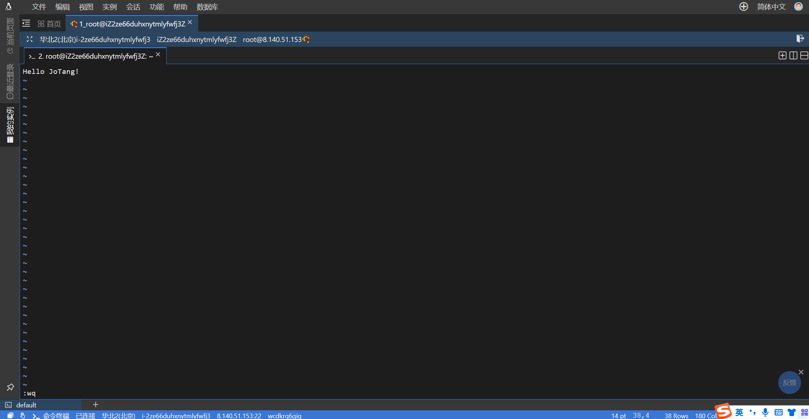
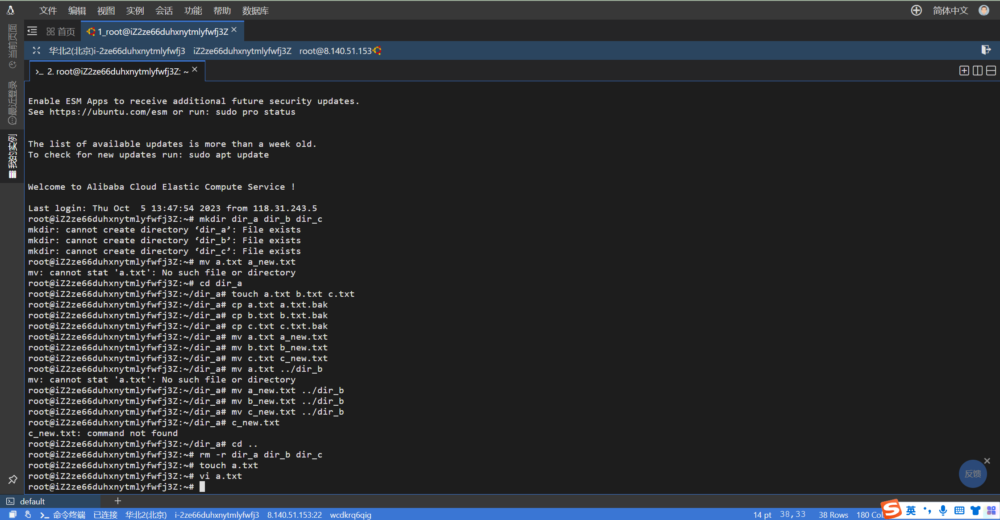
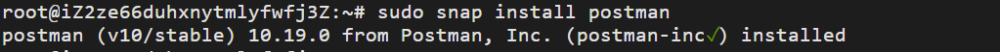

# #6 后端：Java & Spring

## Task 1

### 一、拥有自己的服务器

1.注册阿里云账号并进行学生认证


2.选择配置并领取服务器（截至2023年10月23日我的服务器欠费了）




3.进行远程连接

* 开启Linux 系统中的 SSHD 服务

  

* 通过Workbench远程连接



### 二、Linux基本指令

Linux是一种开源的、基于Unix内核的操作系统，在服务器领域广泛使用。Linux拥有丰富的指令集，以下是一些常用的Linux基本指令。

#### 文件和目录操作

- `ls`: 列出当前目录下的所有文件和目录
- `cd`: 进入指定目录
- `pwd`: 显示当前目录的完整路径
- `mkdir`: 创建新目录
- `touch`: 创建新文件或修改已有文件的访问时间和修改时间
- `cp`: 复制文件或目录
- `mv`: 移动或重命名文件或目录
- `rm`: 删除文件或目录
- `cat`: 显示文件内容
- `grep`: 搜索文件内容
- `diff`: 比较文件内容的差异
- `chmod`: 修改文件或目录的权限
- `chown`: 修改文件或目录的所有者和所属组

#### 系统信息和进程管理

- `uname`: 显示操作系统的信息
- `uptime`: 显示系统的运行时间和平均负载
- `top`: 显示当前正在运行的进程的信息
- `ps`: 显示当前正在运行的进程的信息
- `kill`: 终止指定进程
- `killall`: 终止指定名称的所有进程

#### 网络和端口操作

- `ping`: 测试网络连接并显示延迟时间
- `ifconfig`: 显示网络接口的配置信息
- `netstat`: 显示当前系统的网络连接状态和统计信息
- `route`: 显示或修改系统的网络路由表
- `iptables`: 配置Linux防火墙规则
- `nc`: 用于在Linux中创建TCP/IP连接、打开端口、监听端口和进行数据传输的工具
- `telnet`: 远程登录到指定的主机或服务器
- `ssh`: 远程登录到指定的主机或服务器

#### 压缩和解压缩

- `tar`: 压缩和解压缩文件和目录
- `gzip`: 压缩和解压缩文件
- `bzip2`: 压缩和解压缩文件

#### 软件包管理

- `apt-get`: Debian/Ubuntu软件包管理器（我用的是Ubuntu）
- `yum`: RedHat/CentOS软件包管理器
- `dnf`: Fedora软件包管理器

### 三、Linux基本指令练习

1. 创建文件夹dir_a, dir_b, dir_c：
   * 执行命令：`mkdir dir_a dir_b dir_c`
2. 进入dir_a,创建a.txt, b.txt, c.txt：
   - 执行命令：`cd dir_a`
   - 执行命令：`touch a.txt b.txt c.txt`
3. 将a.txt, b.txt, c.txt 分别复制成: a.txt.bak, b.txt.bak, c.txt.bak：
   - 执行命令：`cp a.txt a.txt.bak`
   - 执行命令：`cp b.txt b.txt.bak`
   - 执行命令：`cp c.txt c.txt.bak`
4. 将a.txt, b.txt, c.txt 分别重命名为: a_new.txt, b_new.txt, c_new.txt：
   - 执行命令：`mv a.txt a_new.txt`
   - 执行命令：`mv b.txt b_new.txt`
   - 执行命令：`mv c.txt c_new.txt`
5. 将dir_a文件夹下的a.txt, b.txt, c.txt分别移动到文件夹dir_b下：*** 疑问：第四步中已经重命名，所以是否为新名称呢？（采取新名称为命令）***
   - 执行命令：`mv a_new.txt ../dir_b`
   - 执行命令：`mv b_new.txt ../dir_b`
   - 执行命令：`mv c_new.txt ../dir_b`
6. 将普通文件a.txt, b.txt, c.txt删除：***是否先进入文件夹dir_b下***
   - 执行命令：`rm a_new.txt`
   - 执行命令：`rm b_new.txt`
   - 执行命令：`rm c_new.txt`
7. 将文件夹dir_a, dir_b, dir_c删除：
   - 执行命令：`cd ..` （返回上一级目录）
   - 执行命令：`rm -r dir_a dir_b dir_c`
8. 创建文件夹dir_0, dir_1, dir_2，并复制重命名文件：
   - 执行命令：`mkdir dir_0 dir_1 dir_2`
   - 执行命令：`cp a.txt dir_0/a0.txt`
   - 执行命令：`cp b.txt dir_0/b0.txt`
   - 执行命令：`cp c.txt dir_0/c0.txt`
   - 执行命令：`cp a.txt dir_1/a1.txt`
   - 执行命令：`cp b.txt dir_1/b1.txt`
   - 执行命令：`cp c.txt dir_1/c1.txt`
   - 执行命令：`cp a.txt dir_2/a2.txt`
   - 执行命令：`cp b.txt dir_2/b2.txt`
   - 执行命令：`cp c.txt dir_2/c2.txt`
9. 将其中所有txt类型的文件删除：
   - 执行命令：`rm dir_0/*.txt`
   - 执行命令：`rm dir_1/*.txt`
   - 执行命令：`rm dir_2/*.txt`
10. 创建文件a.txt：
    - 执行命令：`touch a.txt`
11. 对a.txt进行编辑，输入伟大的Hello JoTang!：
    - 执行命令：`vi a.txt` （进入vim编辑模式）
    - 输入文本内容：Hello JoTang!（先按``i``键进入插入模式）
    - 按下`Esc`键退出编辑模式，并输入`:wq`保存并退出





### 四、Linux的目录结构和文件结构

- ``bin``: 存放系统的重要执行文件，包括一些基本的命令（如`ls`、`cp`、`rm`等）。
- ``boot``: 存放启动Linux系统所需的文件，如内核和引导加载程序。
- ``dev``: 包含设备文件，用于访问系统中的硬件设备，如磁盘驱动器、键盘、鼠标等。
- ``etc``: 存放系统的配置文件，包括用户账户、网络设置、服务配置等。
- ``home``: 每个用户的主目录，用于存放用户的个人文件和设置。
- ``lib``: 存放系统的共享库文件，这些文件被系统和应用程序所使用。
- ``media``: 用于挂载可移动媒体设备，如光盘、U盘等。
- ``mnt``: 临时挂载目录，用于临时挂载其他文件系统。
- ``opt``: 用于安装额外的软件包，通常由第三方提供。
- ``proc``: 虚拟文件系统，提供了关于系统和进程的信息。
- ``root``: 超级用户（即管理员）的主目录。
- ``sbin``: 存放系统管理命令，这些命令通常只能由超级用户执行。
- ``srv``: 存放服务相关的数据文件。
- ``tmp``: 用于存放临时文件，该目录下的文件在系统重启后会被清除。
- ``usr``: 存放用户的应用程序和数据，包括系统软件、库文件、文档等。
- ``var``: 存放变量数据，包括日志文件、邮件、数据库文件等。


## Task 2: Java

### 1.安装Java开发环境

首先需要安装Java开发环境，可以使用以下命令：

```
sudo apt-get install default-jdk
```

### 2. 安装MySQL数据库

安装MySQL数据库以及相关的依赖库，可以使用以下命令：

```
sudo apt-get install mysql-server mysql-client libmysqlclient-dev
```

安装完成后，可以通过以下命令启动MySQL服务：

```
sudo service mysql start
```

### 3.安装Postman

- 在终端中输入以下命令，以安装Postman：

  ```
  sudo snap install postman
  ```

  

### 4.创建一个新的Spring Boot项目：

- 打开浏览器，并访问 [Spring Initializr](https://start.spring.io/)。
- 在 Spring Initializr 网页上，您将看到一些选项需要进行配置：

  - **Project**: 选择 "Maven Project"。
  - **Language**: 选择 "Java"。
  - **Spring Boot**: 选择合适的 Spring Boot 版本。如果不确定，可以选择最新的稳定版本。
  - **Group**: 输入您的项目组织标识符，例如 `com.example`。
  - **Artifact**: 输入您的项目名称，例如 `My Project`。
  - **Name**: 输入项目的显示名称，例如 `My Project`。
  - **Description**: 输入项目的描述信息，例如 `Demo project for Spring Boot`。
  - **Package Name**: 输入项目的主包名，例如 `com.example.myproject`。
  - **Packaging**: 选择 "Jar"。
  - **Java**: 选择您想要使用的 Java 版本。
  - **Dependencies**: 选择您需要的依赖项。至少选择 "Spring Web" 作为基本的 Web 开发依赖。
- 在完成配置后，单击页面底部的 "Generate" 按钮。Spring Initializr 将生成一个可下载的项目压缩包（ZIP 格式）。

### 5.配置数据库连接

在`application.properties`文件中添加数据库连接配置，包括数据库URL、用户名和密码。

```
propertiesCopy Codespring.datasource.url=jdbc:mysql://localhost:3306/blog?useSSL=false&serverTimezone=UTC
spring.datasource.username=root
spring.datasource.password=password
spring.datasource.driver-class-name=com.mysql.cj.jdbc.Driver
```

* 创建Article实体类

创建一个名为Article的实体类，用于映射数据库中的文章表。

```
javaCopy Code@Entity
@Table(name = "articles")
public class Article {
    @Id
    @GeneratedValue(strategy = GenerationType.IDENTITY)
    private Long id;

    @Column(nullable = false)
    private String title;

    @Column(nullable = false, length = 10000)
    private String content;

    // getters and setters
}
```

* 创建ArticleMapper接口（后面都没完成呜呜，而且服务器欠费了)

使用MyBatis-Plus提供的BaseMapper接口进行数据库访问操作。

```
javaCopy Code@Repository
public interface ArticleMapper extends BaseMapper<Article> {
}
```

* 创建ArticleService

创建一个ArticleService类，用于处理业务逻辑。

```
javaCopy Code@Service
public class ArticleService {
    @Autowired
    private ArticleMapper articleMapper;

    public List<Article> getAllArticles() {
        return articleMapper.selectList(null);
    }

    public Article addArticle(Article article) {
        articleMapper.insert(article);
        return article;
    }

    public void updateArticle(Article article) {
        articleMapper.updateById(article);
    }

    public void deleteArticle(Long id) {
        articleMapper.deleteById(id);
    }
}
```

* 创建ArticleController

创建一个ArticleController类，用于处理HTTP请求。

```
javaCopy Code@RestController
@RequestMapping("/articles")
public class ArticleController {
    @Autowired
    private ArticleService articleService;

    @GetMapping("")
    public List<Article> getAllArticles() {
        return articleService.getAllArticles();
    }

    @PostMapping("")
    public Article addArticle(@RequestBody Article article) {
        return articleService.addArticle(article);
    }

    @PutMapping("/{id}")
    public void updateArticle(@PathVariable("id") Long id, @RequestBody Article article) {
        article.setId(id);
        articleService.updateArticle(article);
    }

    @DeleteMapping("/{id}")
    public void deleteArticle(@PathVariable("id") Long id) {
        articleService.deleteArticle(id);
    }
}
```

### 6.编译和运行

编译并运行项目，确保应用程序成功启动。

* 使用Postman进行测试

使用Postman或其他类似工具发送HTTP请求来测试接口功能。例如，使用POST请求添加一篇文章：

URL: http://localhost:8080/articles Method: POST Request Body:

```
jsonCopy Code{
    "title": "Sample Article",
    "content": "This is a sample article content."
}
```

* 部署在服务器上

将项目打包成可执行的JAR文件，并部署到服务器上，确保可以通过服务器的公网IP和对应端口号访问后端接口。